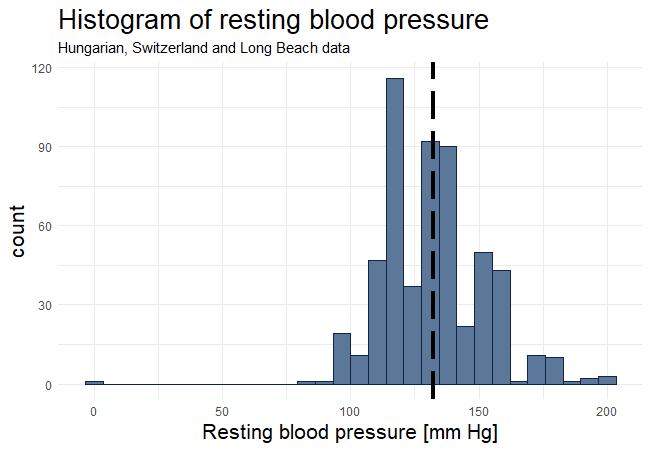
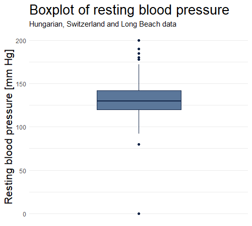
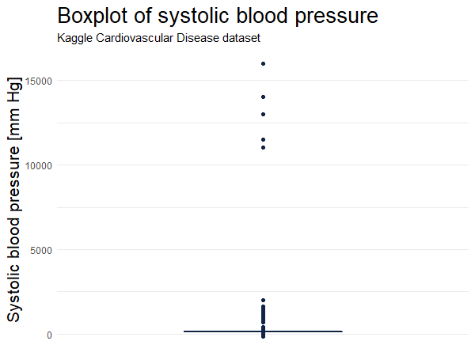
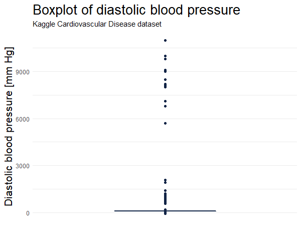

### Preprocessing

All datasets has gone through a cleaning process. The database data are similar in terms of attribute content, so the cleaning process described will be applicable for all of them.  

### Database data
These data contains 76 variables. According to published material [[5]](https://archive.ics.uci.edu/dataset/45/heart+disease), [[6]](https://www.sciencedirect.com/science/article/pii/0002914989905249) and the UCI repository only a subset of 14 variables is used. In this analysis there is chosen 9 variables:   

<ul style="list-style-type:number">
<li><b>id</b> Patient identification number </li>
<li><b>age</b> Age in years </li>
<li><b>sex</b> Sex of patient (1 = female, 2 = male) </li>
<li><b>cp</b> Chest pain type </li>
  <ul style="list-style-type:number">
  <li> Typical angina </li>
  <li> Atypical angina </li>
  <li> Non-anginal pain </li>
  <li> Asymptomatic </li>
  </ul>
<li><b>trestbps</b> Resting blood pressure in mmHg </li>    
<li><b>chol</b> Serum cholesterol in mg/dl </li>
<li><b>smoke</b> Smoking history (1 = true, 0 = false) </li>
<li><b>fbs</b> Fasting blood sugar > 120 mg/dl (1 = true, 0 = false) </li>
<li><b>cvdPresent</b> Diagnosis of heart disease (1 = true, 0 = false) </li>
</ul>

These variables are chosen based on publications and current research of heart disease risk factors (see **About CVD**).  

#### Cleaning steps

The cleaning steps are performed in RStudio. First data is loaded and converted to a tibble data frame. All 76 columns are renamed with their respectively name stated in the databases. The data sets are reduced to contain only the stated 9 variables as above.   

The *sex* variable is transformed from binary to contain 1 and 2 being female and male respectively. This is for easier conduction of plots and further analysis and to match the variable in the Kaggle data.  
The same transformation is made for the **fbs** variable.  
The **cigs** variables has been converted to a binary variable called **smoke**. If the patient has been smoking one or more cigarettes a day the smoke value is 1 else 0.  

The **num** variable in the raw data described with values from 0 to 4 different stages of angiographic disease status. 0 mean lower than 50% diameter narrowing of any of the three arteries: aorta, carotids and torso, that we have in our bodies. 1, 2, 3 and 4 means that there is more than 50% narrowing of any of these 3 main arteries which is classified as the patient is suffering from cardiovascular disease. So this variable is made binary. The value 1 covers the 4 stages of artery narrowing, while 0 means there is no presence of cardiovascular disease. This variable has been renames to **cvdPresent**.   
The resting blood pressure, also called the diastolic blood pressure, **trestbps** is measured in mm Hg. This can range from 60 to 90 or higher. By looking at the distribution of this variable in figure 1. we see it assumes a normal distribution with outliers present as seen in figure 2. Removal of the outliers is based on the standard deviation of the variable. The new upper and lower bound of **trestbps** is based on 3 standard deviations away from the mean. This is only possible by the assumption of data being gaussian distributed as we saw in figure 1.  

<aside class="figures">
<figure>

<figcaption>Fig. 1 - <i>Histogram of 'trestbps' variable count for all database data sets. Vertical striped line  marks the mean resting blood pressure.</i></figcaption>
</figure>

<figure>

<figcaption>Fig. 2 - <i>Boxplot of 'trestbps' variable count for all database data sets.</i></figcaption>
</figure>
</aside>

### Kaggle data 
The Kaggle data originally contains 12 variables, where as some recur in the database datas. In order to match these variables the **gender** column is copied and renamed **sex**, **cholesterol** is renamed to **chol** and **cardio** is renamed to **cvdPresent**.  

**age** is transformed from days to years. The **chol** variable contained numeric values describing the level of mg/dL in the patients blood. To match the database data these values are converted to continuous values collected from a uniform distribution. The range of sampling data for the values 1, 2 and 3 marking normal, above normal and well above normal levels respectively are based on information from [John Hopkins](https://www.hopkinsmedicine.org/health/treatment-tests-and-therapies/lipid-panel) medicine webpage. The max value of cholesterol is set to the maximum value of cholesterol in the **chol** column for all database data sets.  

Two variables are added: **bmi** and **ap_mean**. **bmi** represents the Body Mass Index (BMI) and is calculated from the **height** and **weight** variables. The formula for BMI: *BMI=(weight [kg])/(height [m])^2* 
<!-- $$BMI = \frac{weight [kg]}{(height [m])^{2}}$$.   -->
The final variables in this dataset:

<ul style="list-style-type:number">
<li><b>id</b> Patient identification number </li>
<li><b>age</b> Age in years </li>
<li><b>sex</b> Sex of patient (1 = female, 2 = male) </li>
<li><b>gender</b> Sex of patient ("female", "male") </li>
<li><b>height</b> Height of patient in cm </li>
<li><b>weight</b> Weight of patient in kg </li>
<li><b>ap_hi</b> Systolic blood pressure in mmHg </li>
<li><b>ap_lo</b> Diastolic blood pressure in mmHg </li>
<li><b>ap_mean</b> Mean systolic blood pressure in mmHg </li>
<li><b>chol</b> Serum cholesterol in mg/dl </li>
<li><b>alco</b> Alcohol intake (1 = true, 0 = false) </li>
<li><b>bmi</b> Body Mass Index </li>
<li><b>cvdPresent</b> Diagnosis of heart disease (1 = true, 0 = false) </li>
</ul>

The **height** and **weight** variable values has been kept if they were ranging between 119 and 211 cm and > 30 kg respectively.  
 
Outliers for **ap_hi** and **ap_lo** has been removed based on information from The American College of Cardiology/American Heart Association Guideline for the Prevention, Detection, Evaluation, and Management of High Blood Pressure in Adults [[7]](https://www.cdc.gov/bloodpressure/about.htm). The method for removal is the same as used for **trestbps** described above. See figure 3 and 4 for distribution of the variables with outliers.
Further the restriction of having a higher systolic than diastolic blood pressure is added for each patient.  

<aside class="figures">
<figure>

<figcaption>Fig. 3 - <i>Boxplot of systolic blood pressure for Kaggle data set.</i></figcaption>
</figure>

<figure>

<figcaption>Fig. 4 - <i>Boxplot of diastolic blood pressure for Kaggle data set.</i></figcaption>
</figure>
</aside>

  
    
#### Reference
<ol start="5">
  <li><a href="https://archive.ics.uci.edu/dataset/45/heart+disease">https://archive.ics.uci.edu/dataset/45/heart+disease</a></li>
  <li><a href="ttps://www.sciencedirect.com/science/article/pii/0002914989905249">ttps://www.sciencedirect.com/science/article/pii/0002914989905249</a></li>
  <li><a href="https://www.cdc.gov/bloodpressure/about.htm">https://www.cdc.gov/bloodpressure/about.htm</a></li>
</ol>